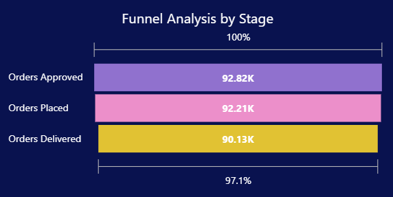
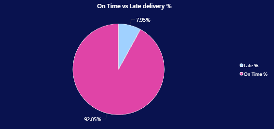
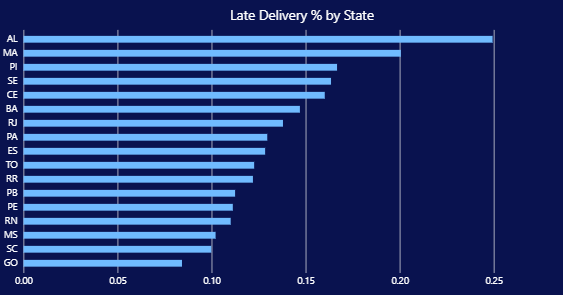

# Revenue Leakage & Funnel Analysis (SQL + Power BI)

## Overview

This project analyzes business performance using the **Olist Brazilian E-commerce dataset**.

It focuses on identifying **revenue leakage and operational inefficiencies** across the order lifecycle by integrating:

* **SQL** → Data extraction, cleaning, and transformation
* **Power BI** → Dashboard creation and business insights


##  Problem Statement

E-commerce businesses often focus on revenue growth but ignore hidden inefficiencies.

Key questions addressed:

* Where are orders dropping in the funnel?
* Why are some orders not converting into successful deliveries?
* How do operational issues impact revenue realization?


## Solution Approach

1. Extracted and cleaned data using SQL
2. Built relational data model (orders, customers, payments, reviews, etc.)
3. Designed KPIs to track:

   * Revenue leakage
   * Funnel conversion
   * Delivery performance
4. Created interactive dashboards in Power BI to uncover insights


## Funnel Analysis (Where Revenue is Lost)



### Insights:

* Orders drop between stages (Approved → Placed → Delivered)
* ~97% conversion rate still results in significant loss at scale
* Small inefficiencies compound into large revenue impact

 **Key Takeaway:**
Even minor drop-offs in the funnel lead to measurable revenue leakage.


## Delivery Performance (Why It Happens)




### Insights:

* ~8% of orders are delivered late
* Certain regions show higher delivery delays
* Late deliveries increase cancellations and failed orders

**Key Takeaway:**
Delivery inefficiency is a major root cause of funnel drop-offs.

## Key Insights

* Revenue leakage is **systematic, not random**
* Operational performance directly impacts revenue
* Funnel efficiency is as important as revenue growth

## Tools & Technologies

* **SQL** → Data extraction, joins, transformations
* **Power BI** → Dashboard development
* **DAX** → KPI calculations

## Dataset
This project uses the Olist Brazilian E-Commerce Dataset, which represents real-world transactional data from a multi-vendor online marketplace operating in Brazil.

The dataset captures the entire lifecycle of an order, starting from purchase to delivery and customer feedback. It is designed in a relational format, where multiple tables are connected to simulate a real production-level database system.

## Project Structure

```id="projfinal"
Revenue-Leakage-Analysis/
│
├── Assets/
├── Power BI File/           #Power BI (.pbix file)
├── SQL Script/              #SQL scripts for data processing
|__ DataSource.md            #Data Source file
└── Insights.md              #Key Findings
|__ README.md

```


## Conclusion

> Revenue growth alone does not reflect business health

By analyzing funnel conversion and delivery performance, this project highlights how **operational inefficiencies directly lead to revenue loss**.


## Future Improvements

* Add predictive analysis (late delivery prediction)
* Include customer segmentation
* Automate pipeline using Python

## Author
Aman Atri

